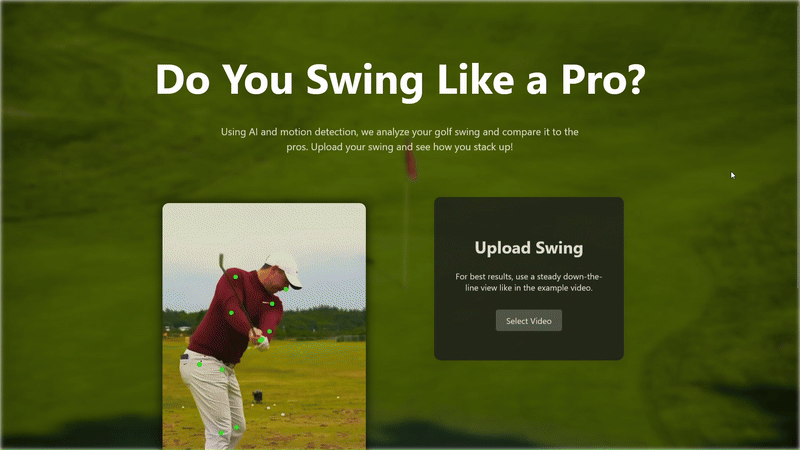

# Golf Swing Analyzer

This project analyzes golf swings and classifies them as either **Pro** or **Amateur** using machine learning and pose estimation.

---

## Installation & Setup

1. Clone the repository:  
   ```bash
   git clone https://github.com/mcapriotti1/Golf_Swing.git
   cd golf-swing-analyzer
2. Install Dependencies (Use Python 3.12.6):
   ```bash
   pip install -r requirements.txt:
3. Run the app locally
   ```bash
   python app.py

## Demo
<div style="text-align: center">
  
</div>

## Pose Extraction

- Used **MediaPipe Pose Landmarker (Heavy)** to extract landmarks.
- Key body parts used for analysis:
  ```python
  KEY_BODY_PARTS = [
  "Left Shoulder", "Right Shoulder", "Left Elbow", "Right Elbow","Left Hip", "Right Hip", "Left Index", 
  "Right Index", "Left Foot Index", "Right Foot Index", "Nose", "Left Knee", "Right Knee" ]
- Extracted landmark data **(x, y, z, visibility, presence)** for each of the listed body parts from **30** evenly spaced frames per video.

  ```python
  selected_indices = np.linspace(0, total_frames - 1, num=num_frames, dtype=int)

- Code for getting the landmark data from a video.

  ```python
  landmarks = create_landmarks("example_video.mp4")

- First we normalize x, y, z positions relative to the left hip:

  ```python
  normalized = normalize_landmarks(landmarks)

- We then calculate velocities for each body part (first frame initialized to 0)

  ```python
    velocity = compute_velocity(prev_frame, frame)

- Next we compute the specified joint angles.

  ```python
    joints_to_compute = [
        ("Right Shoulder", "Right Elbow", "Right Index"), ("Left Hip", "Left Knee", "Left Foot Index"),
        ("Right Hip", "Right Knee", "Right Foot Index"), ("Left Shoulder", "Left Hip", "Left Foot Index"),
        ("Right Shoulder", "Right Hip", "Right Foot Index"), ("Left Elbow", "Left Shoulder", "Left Hip"),
        ("Right Elbow", "Right Shoulder", "Right Hip") ]
    angles = compute_joint_angles(frame)

- Velocities and joint angles are calculated frame by frame, which is done automatically while flattening the array.

  ```python
  flattened = flatten_video(normalized)

---


## Dataset
   - Collected 100 golf swing videos:
     - 50 Pro swings
     - 50 Amateur swings
   - Videos were labeled manually.
## Model Training

We use a **Random Forest Classifier** to classify golf swings as Pro or Amateur. The training process includes data preparation, model training, and evaluation.

### 1. Feature Preparation
Each video is converted into a flattened feature vector containing:
- **Normalized landmark positions** (x, y, z relative to left hip)  
- **Velocities** for each body part (frame-to-frame changes)  
- **Joint angles** computed from key landmarks  

This flattening allows the Random Forest model to process a single vector per video:

   ```python
    X_flat = np.array([flatten_video(video) for video in X])
```

### 2. Train/Test Split

Due to the small dataset, The dataset is split into 80% training and 20% testing while preserving the Pro/Amateur distribution (stratified), a fixed random seed is used to ensure reproducibility of results.:
```python
from sklearn.model_selection import train_test_split
X_train, X_test, y_train, y_test = train_test_split(
    X_flat, y, test_size=0.2, stratify=y, random_state=seed
)
```

### 3.Model Setup

We train a Random Forest Classifier with 100 trees:

```python
from sklearn.ensemble import RandomForestClassifier

model = RandomForestClassifier(n_estimators=100, random_state=seed)
model.fit(X_train, y_train)
```

### 4. Evaluation:

The model is evaluated using precision, recall, F1-score, and support:

```python
from sklearn.metrics import classification_report

y_pred = model.predict(X_test)
print(classification_report(y_test, y_pred))
```

### 5. Training Function:

```python
def train_random_forest(X, y):
    seed = set_seeds()
    print("\n=== Random Forest Classifier ===")
    X_flat = np.array([flatten_video(video) for video in X])
    X_train, X_test, y_train, y_test = train_test_split(
        X_flat, y, test_size=0.2, stratify=y, random_state=seed
    )

    model = RandomForestClassifier(n_estimators=100, random_state=76)
    model.fit(X_train, y_train)
    y_pred = model.predict(X_test)

    print(classification_report(y_test, y_pred))
    return model, y_test, y_pred
```

## Credits

- [MediaPipe](https://developers.google.com/mediapipe) – for pose landmark detection  
- [scikit-learn](https://scikit-learn.org/) – for machine learning models  
- [OpenCV](https://opencv.org/) – for video processing  
- [NumPy](https://numpy.org/) – for numerical computations  

