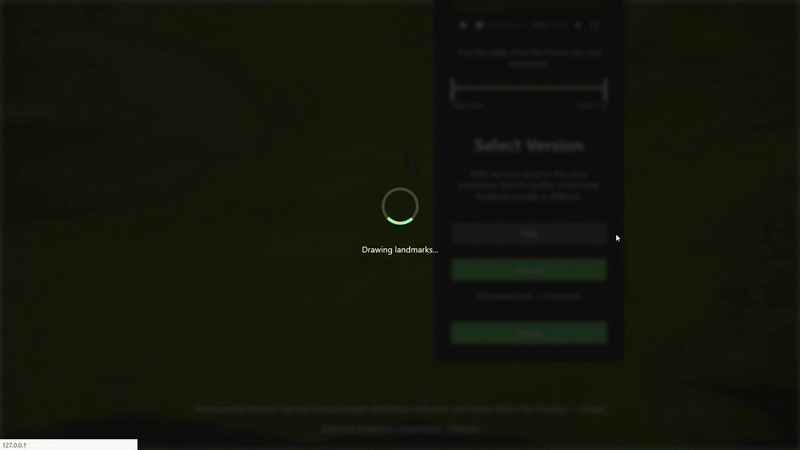

# Golf Swing Analyzer (AI)

This project analyzes golf swings and classifies them as either Pro or Amateur using a **Random Forest Classification** model and pose estimation. Users can upload videos and see predictions via the **Flask web app** [here](https://golf-swing.onrender.com/) (May have to wait 5 minutes).

---

## About the Project

**Tech Used:** Python, Mediapipe, Flask, scikit-learn, NumpPy, OpenCV, Javascript, HTML, CSS

#### Making Model
50 amateur and 50 pro golf swings from Youtube were manually gathered, labeled, and cleaned via a custom trimming and cropping script. Once the data was collected and cleaned, MediaPipe Pose Landmarker (Heavy) was ran on 30 frames of each video, which extracts 3D posistion coordinates, visibilty, and presence. The detection covers very many body parts, but in order to reduce noise due to limited data only key body parts for a golf swing were included. the feet, knees, hips, elbows, hands, shoulders, and nose. For every frame, 3D coordinates were normalized to the left hip, velocities were computed from one frame to the next (initialized as 0), and key joint angles were calculated. All of these components were combined into a single flattened array for each video of normalized posistions, velocities, and joint angles. The Random Forest Classifier (100 trees) was traind on the flattened arrays, with a train/test split of 80/20 with stratification and a fixed random seed. The model performance has an on average accuracy of ~80%, but the  the precision, recall, F1-score, and support are heavily seed dependent.

#### Flask Web App
The web app allows users to upload a vide of their golf swing (MP4/MOV) to get a prediction on their level and annotated video. Since the model was trained on perfectly trimmed videos, the app includes a trim feature. If the user uploads a video that is too short to capture 30 frames or not enough landmarks are detected it displays an error screen. Originally the video trimming, and landmark drawings were done via openCV, but when deployed the methods required too much memory, since the app is hosted on Render's free tier (512 MB of RAM). Videos were preprocessed and trimmed using FFmpeg, while landmark visualization was offloaded to the frontend via JavaScript to reduce memory overhead. Similarly, to maintain efficiency during pose estimation, the MediaPipe Lite model was employed in place of the heavier model.

# Demo

## Front Page
<div style="text-align: center">
  
</div>

## Uploading Video

<div style="text-align: center">
  
</div>

## Prediction

<div style="text-align: center">
  
</div>

## Running Instructions
Unfortunately, given the nature of the training videos coming directly from Youtube, the model training data was kept in a separate folder.

### 1. Run Flask
```bash 
python app.py
```
